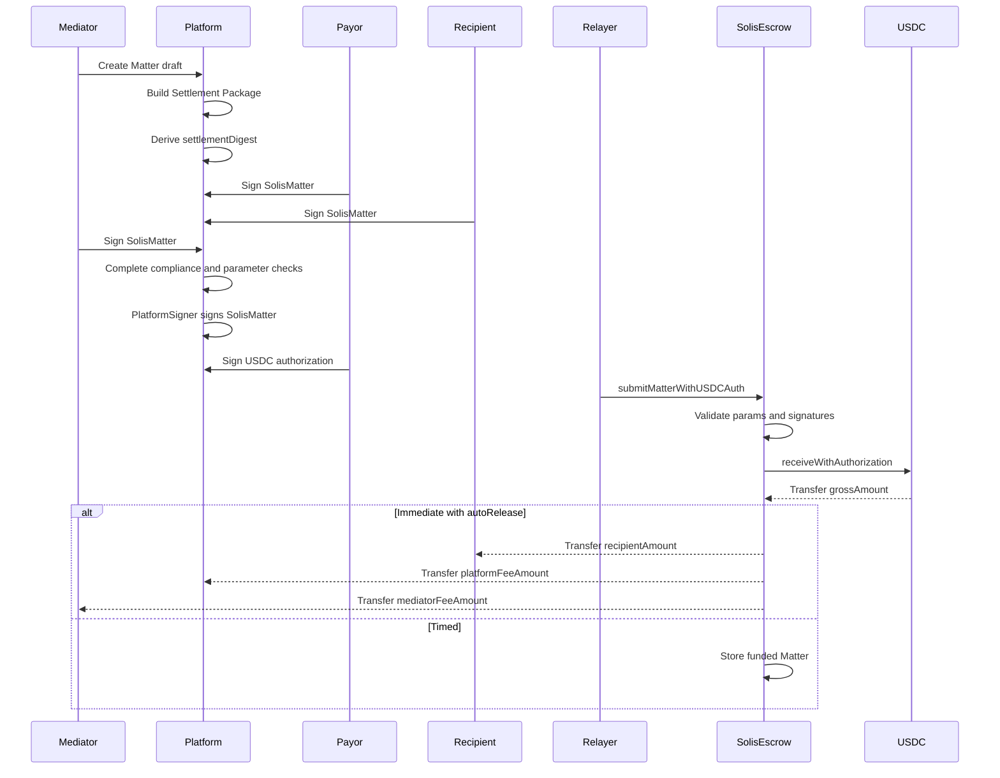
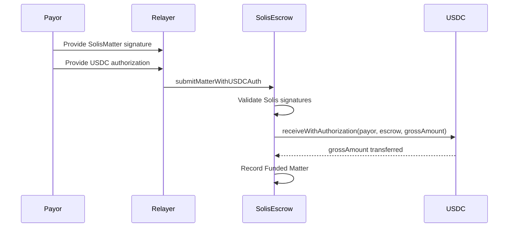
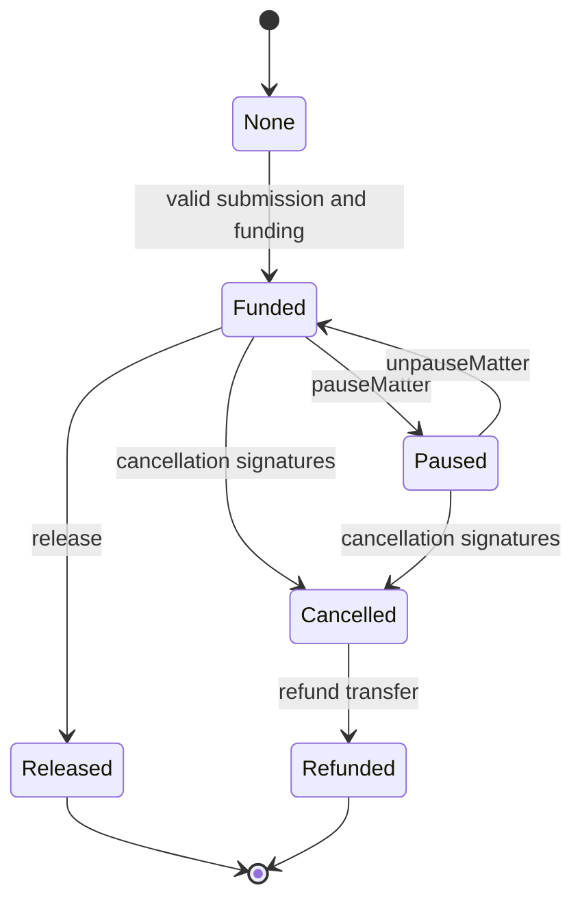

# Solis Solidity Smart Contract Product Design

## 1. Document Purpose

This document defines the Solidity smart contract design for the Solis MVP. It is intended for contract engineering, backend integration, frontend integration, and security review.

The design goal is to keep the on-chain system clear, auditable, and version-routable without relying on proxy upgrades. Solis contracts should execute settlement funding and payouts, while legal text, identity workflows, and negotiation logic stay off-chain.

This document focuses on the on-chain design. Off-chain collaboration, agreement generation, identity verification, signature collection, and compliance screening are described only where they affect contract interaction.

---

## 2. Core Design Decision

Solis MVP does not use a flow where the payor pays first and receives an on-chain credential later. It also does not deploy a full standalone contract for every Matter.

The MVP uses:

```text
SolisRegistry
  -> stores the latest SolisEscrow version address

SolisEscrow V1
  -> one versioned escrow contract holds many Matters
  -> all parties confirm and sign off-chain first
  -> any submitter can submit Matter parameters, signatures, and funding authorization on-chain
  -> the contract verifies signatures, receives funds, escrows funds, and releases or refunds funds
```

Core principles:

1. Legal text, identity data, email addresses, names, agreement bodies, attachments, and template source data are never written on-chain.
2. The chain stores only Matter ID, settlement digest, participant addresses, amounts, fees, time parameters, payout rule, and execution state.
3. Parties complete off-chain review and EIP-712 signing before a Matter is submitted on-chain.
4. The primary funding path should use USDC `receiveWithAuthorization` so the Matter can be submitted and funded in one transaction.
5. Contracts do not use OpenZeppelin Upgradeable, proxy storage, or delegatecall upgrade patterns.
6. Contract version discovery is handled through `SolisRegistry`.
7. New versions are deployed as new `SolisEscrow` contracts and registered in the Registry. Existing Matters continue executing in their original escrow contract.

---

## 3. Key Product Terminology

### 3.1 settlementDigest

The on-chain value named `settlementDigest` is the digest of the off-chain Settlement Package. It is not the legal agreement itself and is not an on-chain credential.

```solidity
bytes32 settlementDigest;
```

Meaning:

> `settlementDigest` is the standardized commitment to the off-chain Settlement Package. It proves that all signatures and on-chain execution parameters refer to the same package.

The digest must be derived from a canonical off-chain representation that includes the relevant agreement and execution parameters. Any salt or nonce used to prevent package correlation should remain off-chain.

---

## 4. System Architecture

### 4.1 Contract Components

The MVP contains two core contracts:

```text
SolisRegistry
SolisEscrow
```

Possible future components:

```text
SolisEscrowFactory
SolisDisputeModule
SolisFeeManager
```

The MVP should avoid unnecessary contract splitting. Fewer contracts reduce audit complexity and integration risk.

---

## 5. Contract Responsibility Boundaries

### 5.1 SolisRegistry Responsibilities

`SolisRegistry` is responsible only for version registration and address discovery. It does not custody funds and does not manage Matter state.

Responsibilities:

1. Register SolisEscrow versions.
2. Mark versions as active or deprecated.
3. Maintain the latest version number.
4. Allow frontends, backends, and third parties to query the latest escrow address.
5. Preserve historical version addresses for old Matter lookup.

Out of scope:

1. Custodying funds.
2. Validating Matter parameters.
3. Releasing or refunding funds.
4. Proxying calls or using delegatecall.

### 5.2 SolisEscrow Responsibilities

`SolisEscrow` is the fund custody and execution contract.

Responsibilities:

1. Receive a complete Matter submission.
2. Verify payor, recipient, mediator, and platform signatures.
3. Validate `settlementDigest`, amounts, fees, addresses, timestamps, and payout rules.
4. Receive payor funds through USDC authorization or ERC-20 allowance.
5. Release funds according to the signed payout rule.
6. Refund funds when a signed cancellation agreement is provided.
7. Pause and unpause funded Matters for compliance or security reasons.
8. Emit indexable events for platform state synchronization.

Out of scope:

1. Generating agreement text.
2. Storing agreement bodies.
3. Storing names, emails, identity documents, or other personal information.
4. Judging legal disputes.
5. Executing scheduled transactions automatically.
6. Bridging funds across chains.

---

## 6. Recommended Minimum Off-Chain Flow

The off-chain flow exists only to produce a safe on-chain submission.

### 6.1 Off-Chain Settlement Package

The platform backend generates a canonical Settlement Package.

At minimum, the package should include:

1. Matter ID.
2. Agreement template version.
3. Agreement PDF or HTML file hash.
4. Structured terms JSON hash.
5. Payor address.
6. Recipient address.
7. Mediator address.
8. Platform fee recipient address.
9. Gross amount.
10. Recipient amount.
11. Platform fee amount.
12. Mediator fee amount.
13. Token address.
14. Chain ID.
15. Payout rule.
16. Release time.
17. Submit deadline.
18. Salt or nonce.

The platform derives:

```text
settlementDigest = keccak256(canonicalSettlementPackage)
```

The salt or nonce should not be emitted publicly on-chain. The platform stores it off-chain.

### 6.2 Party Signatures

Each party reviews the agreement summary and execution parameters, then signs the same EIP-712 typed data.

Required signatures:

```text
PayorSignature
RecipientSignature
MediatorSignature
PlatformSignature
```

Signature meaning:

| Signer    | Purpose                                                                                 |
| --------- | --------------------------------------------------------------------------------------- |
| Payor     | Confirms payment obligation, amounts, fees, token, recipient, and payout rule.          |
| Recipient | Confirms recipient address, recipient amount, settlement digest, and release condition. |
| Mediator  | Confirms Matter details, mediator fee, and settlement digest.                           |
| Platform  | Confirms platform approval, fee configuration, and required pre-submission checks.      |

### 6.3 Payor USDC Payment Authorization

For Ethereum mainnet USDC, the primary path should use:

```text
receiveWithAuthorization
```

The payor signs a USDC payment authorization off-chain. A relayer, the platform, or any party can then submit the Matter and fund it in the same transaction.

For tokens that do not support authorization transfer, a fallback can be used:

```text
submitMatterWithAllowance
```

The primary MVP path remains:

```text
submitMatterWithUSDCAuth
```

---

## 7. Matter Creation Flow Design

### 7.1 Principles

Matter creation is not a multi-stage on-chain flow such as:

```text
Created -> Paid -> RecipientConfirmed
```

The MVP uses:

```text
Off-chain Draft / Review / Signed
        ↓
Single on-chain submission
        ↓
Funded or Released
```

A Matter is not created on-chain until all required off-chain signatures are available.

### 7.2 Recommended Flow

```text
1. Mediator creates a Matter draft on the platform.
2. Platform generates the Settlement Package.
3. Platform derives settlementDigest.
4. Payor, recipient, and mediator confirm and sign SolisMatter typed data.
5. Platform completes KYC, AML, sanctions, and parameter checks.
6. PlatformSigner signs the same typed data.
7. Payor signs USDC payment authorization.
8. Relayer or platform calls submitMatterWithUSDCAuth.
9. SolisEscrow verifies all signatures and parameters.
10. SolisEscrow calls USDC receiveWithAuthorization.
11. If payoutRule is Immediate and autoRelease is true, funds are released in the same transaction.
12. If payoutRule is Timed, funds remain escrowed until releaseTime and any caller can later call release.
```



### 7.3 State Transitions

Immediate payout:

```text
None -> Funded -> Released
```

Timed payout:

```text
None -> Funded -> Released
```

Joint cancellation:

```text
Funded -> Cancelled -> Refunded
```

Compliance or security pause:

```text
Funded -> Paused -> Funded
Funded -> Paused -> Refunded
```

The contract does not include a general operator-controlled refund or operator-controlled release.

---

## 8. Data Model Design

### 8.1 Enums

```solidity
enum PayoutRule {
    Immediate,
    Timed
}

enum MatterStatus {
    None,
    Funded,
    Released,
    Cancelled,
    Refunded,
    Paused
}
```

Notes:

1. There is no on-chain `RecipientConfirmed` state because recipient confirmation happens before submission.
2. There is no on-chain `Rejected` state because rejected Matters should never be submitted.
3. There is no on-chain `Expired` state for recipient confirmation because signing deadlines are off-chain until submission.
4. Off-chain signing expiration is a platform Matter state, not an escrow state.

### 8.2 MatterParams

Submitted Matter parameters:

```solidity
struct MatterParams {
    bytes32 matterId;
    bytes32 settlementDigest;

    address payor;
    address recipient;
    address mediator;
    address platformFeeRecipient;

    address token;

    uint256 grossAmount;
    uint256 recipientAmount;
    uint256 platformFeeAmount;
    uint256 mediatorFeeAmount;

    PayoutRule payoutRule;
    uint64 releaseTime;
    uint64 submitDeadline;

    uint256 registryVersion;
}
```

Field descriptions:

| Field                  | Description                                                     |
| ---------------------- | --------------------------------------------------------------- |
| `matterId`             | Platform-generated unique Matter identifier.                    |
| `settlementDigest`     | Digest of the off-chain Settlement Package.                     |
| `payor`                | Wallet that funds the Matter.                                   |
| `recipient`            | Wallet that receives the net settlement amount.                 |
| `mediator`             | Mediator wallet and mediator fee recipient.                     |
| `platformFeeRecipient` | Platform fee recipient wallet.                                  |
| `token`                | Settlement token. MVP target is Ethereum mainnet USDC.          |
| `grossAmount`          | Total amount paid by the payor.                                 |
| `recipientAmount`      | Net amount received by the recipient.                           |
| `platformFeeAmount`    | Platform fee amount.                                            |
| `mediatorFeeAmount`    | Mediator fee amount.                                            |
| `payoutRule`           | Immediate or Timed.                                             |
| `releaseTime`          | Release timestamp for Timed Matters.                            |
| `submitDeadline`       | Latest timestamp when the signed Matter can be submitted.       |
| `registryVersion`      | SolisEscrow version used by clients and included in signatures. |

### 8.3 Matter Storage

On-chain storage should be minimal:

```solidity
struct Matter {
    bytes32 settlementDigest;

    address payor;
    address recipient;
    address mediator;
    address platformFeeRecipient;
    address token;

    uint256 recipientAmount;
    uint256 platformFeeAmount;
    uint256 mediatorFeeAmount;

    PayoutRule payoutRule;
    MatterStatus status;

    uint64 releaseTime;
    uint64 submittedAt;
    uint64 releasedAt;
}
```

`grossAmount` can be derived:

```text
grossAmount = recipientAmount + platformFeeAmount + mediatorFeeAmount
```

It may still be emitted in submission events for indexing convenience.

### 8.4 Amount Validation Rules

The contract must require:

```solidity
grossAmount > 0
recipientAmount > 0
grossAmount == recipientAmount + platformFeeAmount + mediatorFeeAmount
```

Platform and mediator fees may be zero. Recipient amount must not be zero. USDC amounts are expressed in the token's smallest unit.

---

## 9. EIP-712 Signature Design

### 9.1 Domain

Each `SolisEscrow` version is its own EIP-712 verifying contract.

```text
name:    SolisEscrow
version: 1
chainId: block.chainid
verifyingContract: address(this)
```

This prevents:

1. Cross-chain replay.
2. Cross-contract replay.
3. Reuse of old version signatures on a new escrow.
4. Submission to the wrong escrow contract.

### 9.2 Matter Typed Data

All business signatures cover the same typed data:

```solidity
SolisMatter(
    bytes32 matterId,
    bytes32 settlementDigest,
    address payor,
    address recipient,
    address mediator,
    address platformFeeRecipient,
    address token,
    uint256 grossAmount,
    uint256 recipientAmount,
    uint256 platformFeeAmount,
    uint256 mediatorFeeAmount,
    uint8 payoutRule,
    uint64 releaseTime,
    uint64 submitDeadline,
    uint256 registryVersion
)
```

### 9.3 Signature Verification

The contract verifies:

```text
payorSignature     -> params.payor
recipientSignature -> params.recipient
mediatorSignature  -> params.mediator
platformSignature  -> sigs.platformSigner
```

The contract should support:

1. EOA signatures.
2. EIP-1271 smart contract wallet signatures.

`sigs.platformSigner` is an explicit active-signer hint. The contract verifies that the hinted signer is active and validates `platformSignature`, avoiding unbounded iteration over historical platform signers.

### 9.4 PlatformSignature Purpose

`PlatformSignature` is required.

Without it, anyone who collects payor, recipient, and mediator signatures could submit a Matter with a malicious platform fee recipient or altered platform fee values.

The platform signature confirms:

1. The Matter was approved by Solis.
2. The platform fee recipient is correct.
3. Fee parameters are correct.
4. Required platform-side checks were completed.
5. The `settlementDigest` corresponds to an approved platform record.

---

## 10. USDC Payment Authorization Design

### 10.1 Primary Path: USDC receiveWithAuthorization

For Ethereum mainnet USDC, the preferred funding path uses:

```solidity
interface IUSDCAuth {
    function receiveWithAuthorization(
        address from,
        address to,
        uint256 value,
        uint256 validAfter,
        uint256 validBefore,
        bytes32 nonce,
        uint8 v,
        bytes32 r,
        bytes32 s
    ) external;
}
```

Escrow call:

```solidity
IUSDCAuth(params.token).receiveWithAuthorization(
    params.payor,
    address(this),
    params.grossAmount,
    auth.validAfter,
    auth.validBefore,
    auth.nonce,
    auth.v,
    auth.r,
    auth.s
);
```

After the token call returns, the escrow must verify that its token balance increased by exactly `params.grossAmount` before recording the Matter. This rejects short-transfer, fee-on-transfer, or no-op token behavior.

Benefits:

1. The payor does not need a separate approval transaction.
2. Matter creation and funding can happen in one transaction.
3. A relayer can submit the transaction.
4. The flow matches the off-chain-first settlement model.



### 10.2 Fallback: transferFrom allowance

For tokens that do not support authorization transfer, a fallback function can use ERC-20 allowance:

```solidity
submitMatterWithAllowance(...)
```

This path requires the payor to approve the escrow contract before submission.

As with the USDC authorization path, the escrow must verify an exact `grossAmount` balance increase before creating the Matter.

---

## 11. SolisRegistry Design

### 11.1 Data Structures

```solidity
struct VersionInfo {
    uint256 version;
    address escrow;
    string semver;
    bool active;
    bool deprecated;
    uint64 registeredAt;
}

mapping(uint256 => VersionInfo) public versions;
uint256 public latestVersion;
```

### 11.2 Main Functions

```solidity
function registerVersion(
    uint256 version,
    address escrow,
    string calldata semver
) external onlyOwner;

function setLatestVersion(uint256 version) external onlyOwner;

function deprecateVersion(uint256 version) external onlyOwner;

function reactivateVersion(uint256 version) external onlyOwner;

function getLatestEscrow() external view returns (address);

function getEscrow(uint256 version) external view returns (address);

function isRegisteredEscrow(address escrow) external view returns (bool);
```

`registerVersion` must also confirm that the escrow exposes matching registration metadata:

```text
escrow.registryVersion() == version
escrow.registry() == address(this)
escrow.ESCROW_VERSION() == semver
```

### 11.3 Version Strategy

Example:

```text
V1 -> SolisEscrow 0xAAA...
V2 -> SolisEscrow 0xBBB...
V3 -> SolisEscrow 0xCCC...
```

The Registry changes only the entry point for new Matters. It does not migrate old Matters.

Old Matter lookup should use:

```text
matterId + escrowVersion + escrowAddress + chainId
```

The backend must store:

```text
matterId
registryVersion
escrowAddress
chainId
submitTxHash
settlementDigest
```

### 11.4 Registry Events

```solidity
event VersionRegistered(
    uint256 indexed version,
    address indexed escrow,
    string semver
);

event LatestVersionUpdated(
    uint256 indexed oldVersion,
    uint256 indexed newVersion,
    address indexed escrow
);

event VersionDeprecated(uint256 indexed version, address indexed escrow);

event VersionReactivated(uint256 indexed version, address indexed escrow);
```

---

## 12. SolisEscrow Function Design

### 12.1 submitMatterWithUSDCAuth

Core creation function:

```solidity
function submitMatterWithUSDCAuth(
    MatterParams calldata params,
    SignatureBundle calldata sigs,
    USDCAuthorization calldata auth,
    bool autoRelease
) external nonReentrant whenNotPaused;
```

Responsibilities:

1. Verify the Matter does not exist.
2. Verify `submitDeadline`.
3. Verify token allowlist.
4. Verify non-zero and non-overlapping participant addresses.
5. Verify amount totals.
6. Verify payout rule and release time.
7. Compute EIP-712 digest.
8. Verify payor, recipient, mediator, and hinted active platform signer signatures.
9. Call USDC `receiveWithAuthorization`.
10. Verify escrow token balance increased by exactly `grossAmount`.
11. Store the funded Matter.
12. Emit `MatterSubmittedAndFunded`.
13. If `payoutRule == Immediate && autoRelease == true`, execute release.

### 12.2 release

```solidity
function release(bytes32 matterId) external nonReentrant;
```

Anyone may call this function.

Validation:

1. Matter exists.
2. Status is Funded.
3. Contract is not globally paused.
4. Matter is not paused.
5. If payout rule is Timed, `block.timestamp >= releaseTime`.

Execution:

1. Set status to Released.
2. Set `releasedAt`.
3. Decrease `accountedBalance`.
4. Transfer platform fee.
5. Transfer mediator fee.
6. Transfer recipient amount.
7. Emit `MatterReleased`.

State changes must happen before token transfers.

### 12.3 cancelAndRefundByAgreement

```solidity
function cancelAndRefundByAgreement(
    bytes32 matterId,
    CancellationSignatures calldata sigs
) external nonReentrant;
```

This function cancels a funded or paused Matter and refunds the payor when required parties agree.

The global contract pause is a full emergency freeze. While globally paused, cancellation refunds are blocked even if all cancellation signatures are valid.

Required signatures:

```text
Payor cancellation signature
Recipient cancellation signature
Platform cancellation signature
```

Mediator cancellation signature may be optional for V1 if the product does not require mediator consent for refund.

State transition:

```text
Funded -> Cancelled -> Refunded
Paused -> Cancelled -> Refunded
```

Refund recipient:

```text
payor
```

Refund amount:

```text
recipientAmount + platformFeeAmount + mediatorFeeAmount
```

### 12.4 pauseMatter / unpauseMatter

```solidity
function pauseMatter(bytes32 matterId, bytes32 reasonHash) external onlyPauser;

function unpauseMatter(bytes32 matterId) external onlyPauser;
```

Expected pause use cases:

1. Sanctions screening hit.
2. Court order.
3. Token freeze risk.
4. Contract or platform security incident.
5. Clearly erroneous submission.

`pauseMatter` should not be used as a general dispute resolution tool.

### 12.5 updatePlatformSigner

```solidity
function updatePlatformSigner(address newSigner) external onlyOwner;
```

Signer rotation affects unsubmitted Matters. The backend must stop or refresh old signing flows when signer policy changes.

For operational flexibility, V1 should support multiple platform signers:

```solidity
mapping(address => bool) public platformSigners;
```

Submission and cancellation signature bundles include the intended `platformSigner` address. Signer rotation is enforced by `platformSigners[platformSigner]`.

---

## 13. SolisEscrow Event Design

### 13.1 MatterSubmittedAndFunded

```solidity
event MatterSubmittedAndFunded(
    bytes32 indexed matterId,
    bytes32 indexed settlementDigest,
    address indexed payor,
    address recipient,
    address mediator,
    address token,
    uint256 grossAmount,
    uint256 recipientAmount,
    uint256 platformFeeAmount,
    uint256 mediatorFeeAmount,
    PayoutRule payoutRule,
    uint64 releaseTime,
    uint256 registryVersion
);
```

### 13.2 MatterReleased

```solidity
event MatterReleased(
    bytes32 indexed matterId,
    address indexed recipient,
    uint256 recipientAmount,
    address platformFeeRecipient,
    uint256 platformFeeAmount,
    address mediator,
    uint256 mediatorFeeAmount,
    uint64 releasedAt
);
```

### 13.3 MatterCancelledAndRefunded

```solidity
event MatterCancelledAndRefunded(
    bytes32 indexed matterId,
    address indexed payor,
    uint256 refundAmount,
    uint64 refundedAt,
    bytes32 cancellationDigest
);
```

### 13.4 MatterPaused / MatterUnpaused

```solidity
event MatterPaused(
    bytes32 indexed matterId,
    bytes32 indexed reasonHash,
    address indexed operator
);

event MatterUnpaused(
    bytes32 indexed matterId,
    address indexed operator
);
```

### 13.5 PlatformSignerUpdated

```solidity
event PlatformSignerUpdated(address indexed signer, bool active);
```

---

## 14. Query Interface Design

### 14.1 getMatter

```solidity
function getMatter(bytes32 matterId) external view returns (Matter memory);
```

### 14.2 getMatterStatus

```solidity
function getMatterStatus(bytes32 matterId) external view returns (MatterStatus);
```

### 14.3 getSettlementDigest

```solidity
function getSettlementDigest(bytes32 matterId) external view returns (bytes32);
```

### 14.4 isReleasable

```solidity
function isReleasable(bytes32 matterId) external view returns (bool);
```

Logic:

```text
status == Funded
and (
    payoutRule == Immediate
    or block.timestamp >= releaseTime
)
```

Paused Matters are not releasable because their status is Paused.

### 14.5 getPayoutBreakdown

```solidity
function getPayoutBreakdown(bytes32 matterId)
    external
    view
    returns (
        uint256 recipientAmount,
        uint256 platformFeeAmount,
        uint256 mediatorFeeAmount,
        uint256 grossAmount
    );
```

---

## 15. Permission Design

### 15.1 Owner

Owner should be controlled by a multisig.

Owner permissions:

1. Manage platform signers.
2. Manage pausers.
3. Manage allowed tokens.
4. Pause or unpause the contract through pauser permissions.
5. Set the Registry address.
6. Sweep excess tokens that are not accounted as escrowed funds.

Owner must not be able to:

1. Arbitrarily release user funds.
2. Arbitrarily refund user funds.
3. Modify amounts or recipient addresses for an existing Matter.
4. Withdraw accounted escrow funds.

### 15.2 PlatformSigner

PlatformSigner is an off-chain authorization role. It does not need direct contract administration power.

Purpose:

1. Authorize Matter creation.
2. Authorize cancellation.
3. Confirm platform fee configuration.

### 15.3 Pauser

Pauser can pause Matters or the whole contract.

Recommended holder:

```text
Platform security multisig or compliance multisig
```

### 15.4 Public Caller

The following functions should be callable by anyone:

```text
submitMatterWithUSDCAuth
submitMatterWithAllowance
release
```

Reasons:

1. Relayers can submit Matters.
2. Payor, recipient, or mediator can submit directly.
3. Timed release does not depend on a platform-controlled keeper.

---

## 16. Payout Rule Design

### 16.1 Immediate

Parameter requirement:

```text
payoutRule = Immediate
releaseTime = 0
```

Execution:

1. Matter is submitted and funded.
2. If `autoRelease = true`, funds are split and transferred in the same transaction.
3. If `autoRelease = false`, any caller can later call `release`.

Recommended product default:

```text
autoRelease = true
```

### 16.2 Timed

Parameter requirement:

```text
payoutRule = Timed
releaseTime > block.timestamp
releaseTime >= submitDeadline
```

Execution:

1. Matter is submitted and funded.
2. Funds remain in escrow.
3. Any caller can call `release` after `block.timestamp >= releaseTime`.

The contract does not automatically execute transactions when time passes. The platform may run a keeper or backend task, but release remains permissionless.

---

## 17. Cancellation and Refund Design

Because the MVP uses off-chain signing before on-chain submission, there is no primary flow for automatic refund caused by recipient non-confirmation.

On-chain refund handles:

1. Funded but unreleased Matter cancelled by required signatures.
2. Paused Matter refunded by required signatures.
3. Future dispute module decisions, if introduced in a later version.

MVP should not provide:

```text
operatorRefund
ownerRefund
mediatorRefund
```

These functions would create high trust and legal risk.



---

## 18. Security Design

### 18.1 Replay Protection

Replay protection comes from:

1. EIP-712 domain includes chain ID.
2. EIP-712 domain includes verifying contract.
3. `matterId` must be unique.
4. Contract requires `matters[matterId].status == None`.
5. USDC authorization has its own nonce.
6. `submitDeadline` limits submission lifetime.
7. `registryVersion` is included in typed data.

### 18.2 Reentrancy Protection

All functions that transfer tokens must use:

```solidity
nonReentrant
```

They must follow:

```text
checks -> effects -> interactions
```

### 18.3 Token Safety

MVP target token:

```text
Ethereum Mainnet USDC
```

The contract should maintain:

```solidity
mapping(address => bool) public allowedTokens;
```

All ERC-20 transfers should use SafeERC20.

Funding paths should measure the escrow token balance before and after the token transfer and require an exact `grossAmount` increase before increasing `accountedBalance`.

### 18.4 Address Validation

The contract must reject:

```text
payor == address(0)
recipient == address(0)
mediator == address(0)
platformFeeRecipient == address(0)
token == address(0)
payor == recipient
```

The MVP should also reject overlapping economic roles where practical to reduce ambiguity.

### 18.5 Fee Safety

The contract should not calculate fees from dynamic rates.

The signed payload includes fixed amounts:

```text
platformFeeAmount
mediatorFeeAmount
recipientAmount
```

### 18.6 Signature Safety

Use standard libraries:

```text
ECDSA
SignatureChecker
EIP712
```

The system uses standard non-upgradeable contracts and libraries, not upgradeable proxy variants.

### 18.7 No Arbitrary Withdrawal of User Funds

The contract may provide `sweepExcessToken`, but it must not withdraw escrowed funds.

The contract should maintain:

```solidity
mapping(address => uint256) public accountedBalance;
```

Funding increases `accountedBalance`.

Release and refund decrease `accountedBalance`.

Sweepable amount:

```text
token.balanceOf(address(this)) - accountedBalance[token]
```

---

## 19. Error Definitions

Use custom errors to reduce gas and improve integration clarity.

```solidity
error MatterAlreadyExists(bytes32 matterId);
error MatterNotFound(bytes32 matterId);
error InvalidStatus(bytes32 matterId, MatterStatus status);
error InvalidAddress();
error InvalidToken(address token);
error InvalidAmount();
error InvalidPayoutRule();
error SubmitDeadlineExpired();
error ReleaseTimeNotReached();
error InvalidSignature(address expectedSigner);
error InvalidPlatformSignature();
error InvalidFundingAmount(address token, uint256 expectedAmount, uint256 actualAmount);
error Unauthorized();
error MatterPausedError(bytes32 matterId);
error InvalidVersion();
```

---

## 20. Solidity Interface Draft

### 20.1 ISolisRegistry

```solidity
interface ISolisRegistry {
    function latestVersion() external view returns (uint256);
    function getLatestEscrow() external view returns (address);
    function getEscrow(uint256 version) external view returns (address);
    function isRegisteredEscrow(address escrow) external view returns (bool);
}
```

### 20.2 ISolisEscrow

```solidity
interface ISolisEscrow {
    enum PayoutRule {
        Immediate,
        Timed
    }

    enum MatterStatus {
        None,
        Funded,
        Released,
        Cancelled,
        Refunded,
        Paused
    }

    struct MatterParams {
        bytes32 matterId;
        bytes32 settlementDigest;
        address payor;
        address recipient;
        address mediator;
        address platformFeeRecipient;
        address token;
        uint256 grossAmount;
        uint256 recipientAmount;
        uint256 platformFeeAmount;
        uint256 mediatorFeeAmount;
        PayoutRule payoutRule;
        uint64 releaseTime;
        uint64 submitDeadline;
        uint256 registryVersion;
    }

    struct SignatureBundle {
        bytes payorSignature;
        bytes recipientSignature;
        bytes mediatorSignature;
        address platformSigner;
        bytes platformSignature;
    }

    struct USDCAuthorization {
        uint256 validAfter;
        uint256 validBefore;
        bytes32 nonce;
        uint8 v;
        bytes32 r;
        bytes32 s;
    }

    struct CancellationSignatures {
        bytes payorSignature;
        bytes recipientSignature;
        address platformSigner;
        bytes platformSignature;
        bytes mediatorSignature;
    }

    function submitMatterWithUSDCAuth(
        MatterParams calldata params,
        SignatureBundle calldata sigs,
        USDCAuthorization calldata auth,
        bool autoRelease
    ) external;

    function submitMatterWithAllowance(
        MatterParams calldata params,
        SignatureBundle calldata sigs,
        bool autoRelease
    ) external;

    function release(bytes32 matterId) external;

    function cancelAndRefundByAgreement(
        bytes32 matterId,
        CancellationSignatures calldata sigs
    ) external;
}
```

---

## 21. Frontend Integration

### 21.1 Get Latest Escrow

At startup, frontend clients should call:

```text
registry.getLatestEscrow()
```

The returned address is the current escrow contract for new Matters.

### 21.2 Display Signing Content

Before requesting signatures, the frontend must display:

1. Agreement summary.
2. Gross payment amount.
3. Recipient amount.
4. Platform fee.
5. Mediator fee.
6. Token.
7. Chain ID.
8. Release time.
9. Matter ID.
10. Settlement digest.
11. Escrow contract address.

The payor's SolisMatter signature and USDC authorization signature are separate signatures and must be presented as separate actions.

### 21.3 Signing Order

Recommended order:

```text
Mediator confirms draft
Payor signs SolisMatter
Recipient signs SolisMatter
Mediator signs SolisMatter
Platform signs SolisMatter
Payor signs USDC payment authorization
Relayer submits
```

---

## 22. Backend Minimum Responsibilities

The backend must support only what the on-chain flow requires:

1. Generate Matter IDs.
2. Canonicalize Settlement Packages.
3. Derive `settlementDigest`.
4. Store salt, agreement file, structured digest inputs, and signature records.
5. Collect EIP-712 signatures.
6. Complete KYC, AML, sanctions, and pre-submission checks.
7. Produce PlatformSignature.
8. Submit or assist with `submitMatterWithUSDCAuth`.
9. Listen to contract events.
10. Store `matterId + escrowAddress + registryVersion + txHash + settlementDigest`.

The backend must not assume it is the only executor. `release` remains permissionless.

---

## 23. Audit Focus

Security review should focus on:

1. EIP-712 digest matching frontend signed data exactly.
2. SignatureChecker support for EOA and EIP-1271.
3. `matterId` uniqueness.
4. `settlementDigest` being covered by every required signature.
5. `grossAmount` equaling the sum of payout amounts.
6. USDC `receiveWithAuthorization` binding `from`, `to`, and `value` correctly.
7. Release not being executable twice.
8. Cancellation requiring sufficient authorization.
9. Pause not creating platform custody or fund redirection power.
10. Sweep not being able to withdraw `accountedBalance`.
11. Old escrow versions continuing independently after Registry updates.
12. Registry owner risk when registering malicious escrow addresses.

---

## 24. MVP Non-Goals

The MVP does not include:

1. Multiple payors.
2. Multiple recipients.
3. Multi-stage payouts.
4. Milestone dispute judgment.
5. Cross-chain payment.
6. Native ETH payment.
7. Arbitrary token support without allowlisting.
8. On-chain agreement body storage.
9. On-chain identity data storage.
10. Platform unilateral dispute resolution.
11. Proxy upgrades.
12. Full standalone escrow contract per Matter.

---

## 25. Future Extensions

### 25.1 Multiple Recipients

Future versions may split recipient payouts:

```solidity
struct RecipientPayout {
    address recipient;
    uint256 amount;
}
```

### 25.2 Multi-Stage Payouts

Future versions may introduce installments:

```solidity
struct Installment {
    uint256 amount;
    uint64 releaseTime;
    bool released;
}
```

### 25.3 Dispute Module

V1 should not embed complex dispute resolution.

A later version can add:

```text
SolisDisputeModule
```

Matter parameters can specify a dispute resolver address and rules.

### 25.4 Per-Matter Lightweight Contracts

If future customers require a unique on-chain address per Matter, a later version can add:

```text
SolisEscrowFactory + minimal proxy clones
```

The Registry can still be used to discover the latest factory or implementation.

---

## 26. Recommended Development Milestones

### Phase 1: Contract Prototype

1. SolisRegistry.
2. SolisEscrow base data model.
3. EIP-712 Matter signature verification.
4. `submitMatterWithAllowance` test path.
5. Immediate and timed release paths.

### Phase 2: USDC Authorization Transfer

1. Integrate USDC `receiveWithAuthorization`.
2. Add mainnet fork tests.
3. Complete payor authorization frontend integration.

### Phase 3: Security Hardening

1. EIP-1271 support.
2. `accountedBalance`.
3. Pause and unpause.
4. `cancelAndRefundByAgreement`.
5. Custom errors.
6. Complete indexable events.

### Phase 4: Audit Readiness

1. Unit test coverage.
2. Fuzz tests for amounts and state transitions.
3. Mainnet fork tests for USDC.
4. Typed data compatibility tests across frontend and backend.
5. External security audit.

---

## 27. Final Recommendation

Solis MVP should remain a deterministic, low-permission fund execution system.

Recommended on-chain model:

```text
Parties collaborate and sign off-chain
Then submit Matter + signatures + USDC authorization once
Contract verifies signatures and funding
Contract escrows or releases funds
Registry handles non-proxy version discovery
Old Matters remain in their original escrow contracts
```

This design is preferable because:

1. It avoids the payor-funded-but-recipient-unconfirmed failure mode.
2. It avoids signature ambiguity caused by creating on-chain identifiers after payment.
3. It reduces on-chain state complexity.
4. It reduces user transaction count.
5. It is easier to explain to legal service customers.
6. It is easier to audit.
7. It supports non-proxy version upgrades through Registry routing.

The MVP succeeds if every Matter has clear signatures, clear amounts, clear fund flow, clear state, clear permission boundaries, and clear historical version lookup.
