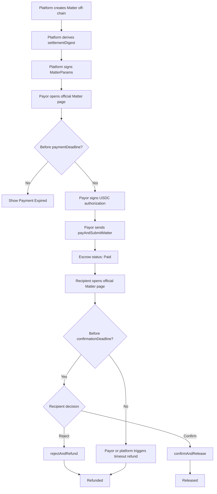
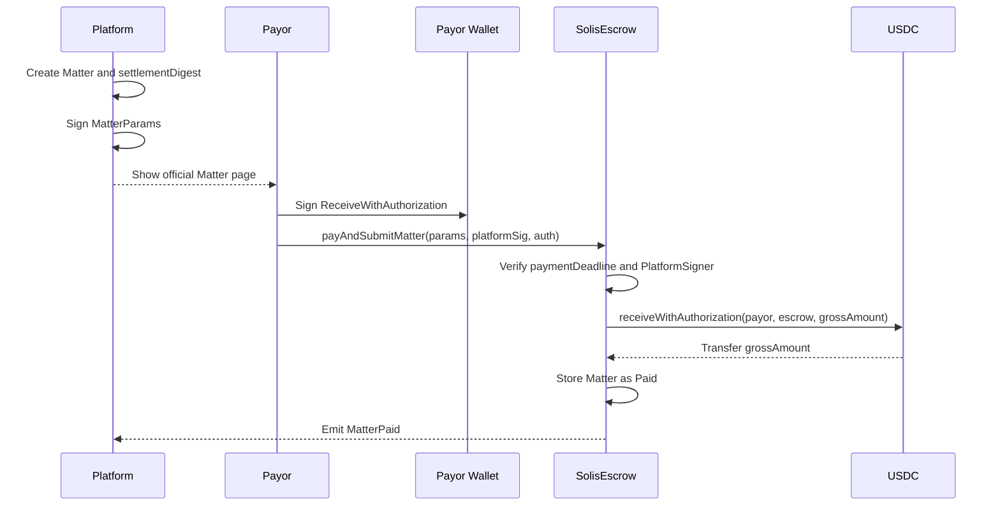
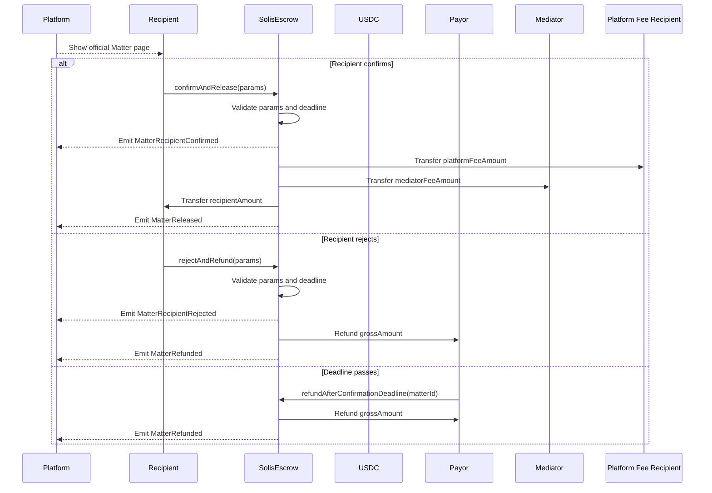

# Solis Wallet and Frontend Integration Guide

## Purpose

This guide is for wallet, frontend, and backend engineers integrating with Solis v1.3 escrow contracts.

Solis v1.3 uses:

- `SolisRegistry` for escrow version discovery.
- `SolisEscrow` for Matter funding, Recipient confirmation, release, rejection, and refund.
- USDC `receiveWithAuthorization` for Payor funding.
- PlatformSigner EIP-712 approval for Matter parameters.

The contract does not store legal text, names, emails, identity data, attachments, document hashes, salts, or raw settlement packages. The only on-chain off-chain commitment is `settlementDigest`.

## Roles

| Role              | Integration responsibility                                                                                              |
| ----------------- | ----------------------------------------------------------------------------------------------------------------------- |
| Platform backend  | Creates Matter records, derives `settlementDigest`, signs `MatterParams`, stores documents off-chain, indexes events.   |
| Frontend          | Displays official Matter details, asks wallets to sign USDC authorization, submits escrow transactions, shows statuses. |
| Payor wallet      | Signs USDC `ReceiveWithAuthorization` typed data and sends `payAndSubmitMatter`.                                        |
| Recipient wallet  | Sends `confirmAndRelease` or `rejectAndRefund`.                                                                         |
| Platform operator | May call timeout refund after `confirmationDeadline`; cannot redirect funds.                                            |

## Contract Discovery

Frontends should route through `SolisRegistry` for the latest escrow.

```ts
import { getContract, parseAbi } from "viem";

const registryAbi = parseAbi([
  "function latestVersion() view returns (uint256)",
  "function getLatestEscrow() view returns (address)",
]);

const registry = getContract({
  address: registryAddress,
  abi: registryAbi,
  client: publicClient,
});

const latestEscrow = await registry.read.getLatestEscrow();
const registryVersion = await registry.read.latestVersion();
```

Before showing a payment or confirmation screen, verify that the platform-provided Matter points to the same chain, registry version, token, and escrow address the frontend is using.

## Matter Parameters

`MatterParams` is the canonical parameter set shown to users and submitted to the escrow.

```solidity
struct MatterParams {
    bytes32 matterId;
    bytes32 settlementDigest;
    address payor;
    address recipient;
    address mediator;
    address platformFeeRecipient;
    address token;
    uint256 grossAmount;
    uint256 recipientAmount;
    uint256 platformFeeAmount;
    uint256 mediatorFeeAmount;
    uint64 paymentDeadline;
    uint64 confirmationDeadline;
    uint256 registryVersion;
}
```

Validation expectations:

- `matterId` and `settlementDigest` must be non-zero.
- `token` must equal the escrow `settlementToken`.
- `grossAmount == recipientAmount + platformFeeAmount + mediatorFeeAmount`.
- `recipientAmount > 0`.
- `paymentDeadline` must still be valid when Payor submits.
- `confirmationDeadline` must be later than `paymentDeadline`.
- `registryVersion` must equal the escrow `registryVersion`.

Amounts use the token's smallest unit. For USDC, use 6 decimals.

## PlatformSigner Typed Data

The platform signs Matter parameters with the escrow EIP-712 domain:

```ts
const solisDomain = {
  name: "SolisEscrow",
  version: "1",
  chainId,
  verifyingContract: escrowAddress,
} as const;

const solisMatterTypes = {
  SolisMatter: [
    { name: "matterId", type: "bytes32" },
    { name: "settlementDigest", type: "bytes32" },
    { name: "payor", type: "address" },
    { name: "recipient", type: "address" },
    { name: "mediator", type: "address" },
    { name: "platformFeeRecipient", type: "address" },
    { name: "token", type: "address" },
    { name: "grossAmount", type: "uint256" },
    { name: "recipientAmount", type: "uint256" },
    { name: "platformFeeAmount", type: "uint256" },
    { name: "mediatorFeeAmount", type: "uint256" },
    { name: "paymentDeadline", type: "uint64" },
    { name: "confirmationDeadline", type: "uint64" },
    { name: "registryVersion", type: "uint256" },
  ],
} as const;
```

The frontend receives this from the backend:

```ts
type PlatformSignature = {
  signer: `0x${string}`;
  signature: `0x${string}`;
};
```

The escrow checks that `signer` is an active PlatformSigner and that `signature` is valid for `MatterParams`.

## Payor Funding

The Payor must:

1. Review Matter details on the official platform page.
2. Sign USDC `ReceiveWithAuthorization` typed data.
3. Send `payAndSubmitMatter(params, platformSig, auth)` from the Payor wallet.

### USDC Authorization Typed Data

Use the USDC token's EIP-712 domain for the target chain. For local tests, `MockUSDC` uses `name: "MockUSDC"` and `version: "1"`. Production integrations must use the production token domain for that chain.

```ts
import { bytesToHex, parseSignature } from "viem";

const usdcAuthorizationTypes = {
  ReceiveWithAuthorization: [
    { name: "from", type: "address" },
    { name: "to", type: "address" },
    { name: "value", type: "uint256" },
    { name: "validAfter", type: "uint256" },
    { name: "validBefore", type: "uint256" },
    { name: "nonce", type: "bytes32" },
  ],
} as const;

const usdcDomain = {
  name: "USD Coin",
  version: "2",
  chainId,
  verifyingContract: params.token,
} as const;

const authorizationMessage = {
  from: params.payor,
  to: escrowAddress,
  value: params.grossAmount,
  validAfter: 0n,
  validBefore: BigInt(Math.floor(Date.now() / 1000) + 30 * 60),
  nonce: bytesToHex(crypto.getRandomValues(new Uint8Array(32))),
};

const authorizationSignature = await walletClient.signTypedData({
  account: params.payor,
  domain: usdcDomain,
  types: usdcAuthorizationTypes,
  primaryType: "ReceiveWithAuthorization",
  message: authorizationMessage,
});

const parsed = parseSignature(authorizationSignature);

const auth = {
  validAfter: authorizationMessage.validAfter,
  validBefore: authorizationMessage.validBefore,
  nonce: authorizationMessage.nonce,
  v: Number(parsed.v ?? BigInt(27 + parsed.yParity)),
  r: parsed.r,
  s: parsed.s,
};
```

### Submit Payment

```ts
import { getContract, parseAbi } from "viem";

const solisEscrowAbi = parseAbi([
  "function payAndSubmitMatter((bytes32 matterId,bytes32 settlementDigest,address payor,address recipient,address mediator,address platformFeeRecipient,address token,uint256 grossAmount,uint256 recipientAmount,uint256 platformFeeAmount,uint256 mediatorFeeAmount,uint64 paymentDeadline,uint64 confirmationDeadline,uint256 registryVersion) params,(address signer,bytes signature) platformSig,(uint256 validAfter,uint256 validBefore,bytes32 nonce,uint8 v,bytes32 r,bytes32 s) auth)",
  "function confirmAndRelease((bytes32 matterId,bytes32 settlementDigest,address payor,address recipient,address mediator,address platformFeeRecipient,address token,uint256 grossAmount,uint256 recipientAmount,uint256 platformFeeAmount,uint256 mediatorFeeAmount,uint64 paymentDeadline,uint64 confirmationDeadline,uint256 registryVersion) params)",
  "function rejectAndRefund((bytes32 matterId,bytes32 settlementDigest,address payor,address recipient,address mediator,address platformFeeRecipient,address token,uint256 grossAmount,uint256 recipientAmount,uint256 platformFeeAmount,uint256 mediatorFeeAmount,uint64 paymentDeadline,uint64 confirmationDeadline,uint256 registryVersion) params)",
  "function refundAfterConfirmationDeadline(bytes32 matterId)",
  "function getMatterStatus(bytes32 matterId) view returns (uint8)",
]);

const escrow = getContract({
  address: escrowAddress,
  abi: solisEscrowAbi,
  client: { public: publicClient, wallet: walletClient },
});

const txHash = await escrow.write.payAndSubmitMatter(
  [params, platformSig, auth],
  { account: params.payor },
);
```

The escrow:

- Requires `msg.sender == params.payor`.
- Verifies the PlatformSigner signature.
- Calls `receiveWithAuthorization(params.payor, escrow, params.grossAmount, ...)`.
- Requires the token balance increase to equal `grossAmount`.
- Stores the Matter as `Paid`.
- Emits `MatterPaid`.

If the transaction succeeds, the frontend should show the Matter as `Payor Paid` and wait for Recipient action.

## Recipient Confirmation

The Recipient must review the official platform page and submit the full `MatterParams`.

```ts
const txHash = await escrow.write.confirmAndRelease([params], {
  account: params.recipient,
});
```

The escrow:

- Requires the Matter to be `Paid`.
- Requires `msg.sender == params.recipient`.
- Requires `block.timestamp <= confirmationDeadline`.
- Requires submitted params to match the stored Matter snapshot.
- Emits `MatterRecipientConfirmed`.
- Immediately releases funds and emits `MatterReleased`.

Final stored status is `Released`.

## Recipient Rejection

Recipient rejection refunds the full gross amount to the Payor.

```ts
const txHash = await escrow.write.rejectAndRefund([params], {
  account: params.recipient,
});
```

The escrow:

- Requires the Matter to be `Paid`.
- Requires `msg.sender == params.recipient`.
- Requires `block.timestamp <= confirmationDeadline`.
- Emits `MatterRecipientRejected`.
- Refunds full `grossAmount` to Payor and emits `MatterRefunded`.

Final stored status is `Refunded`.

## Confirmation Deadline Refund

If the Recipient does not act before `confirmationDeadline`, the Payor or a platform operator can trigger refund.

```ts
const txHash = await escrow.write.refundAfterConfirmationDeadline([matterId], {
  account: payorOrPlatformOperator,
});
```

The refund recipient is always the stored Payor. The caller cannot choose another destination.

## Read APIs

```ts
const matter = await escrow.read.getMatter([matterId]);
const status = await escrow.read.getMatterStatus([matterId]);
const settlementDigest = await escrow.read.getSettlementDigest([matterId]);
const [paymentDeadline, confirmationDeadline] = await escrow.read.getDeadlines([
  matterId,
]);
const actionable = await escrow.read.isRecipientActionable([matterId]);
const [recipientAmount, platformFeeAmount, mediatorFeeAmount, grossAmount] =
  await escrow.read.getPayoutBreakdown([matterId]);
```

Status enum:

| Value | Status               | Meaning                                    |
| ----- | -------------------- | ------------------------------------------ |
| 0     | `None`               | Unknown or not submitted.                  |
| 1     | `Paid`               | Payor funded; waiting for Recipient.       |
| 2     | `RecipientConfirmed` | Transient during confirmation transaction. |
| 3     | `Released`           | Funds released.                            |
| 4     | `RecipientRejected`  | Transient during rejection transaction.    |
| 5     | `Refunded`           | Funds refunded to Payor.                   |
| 6     | `Paused`             | Matter is frozen by platform operator.     |

## Event Indexing

Index these events to synchronize platform state:

```solidity
event MatterPaid(...);
event MatterRecipientConfirmed(...);
event MatterReleased(...);
event MatterRecipientRejected(...);
event MatterRefunded(...);
event MatterPaused(...);
event MatterUnpaused(...);
```

Recommended platform mapping:

| Contract event             | Platform display state      |
| -------------------------- | --------------------------- |
| `MatterPaid`               | Payor Paid                  |
| `MatterRecipientConfirmed` | Recipient Confirmed         |
| `MatterReleased`           | Funds Released or Completed |
| `MatterRecipientRejected`  | Recipient Rejected          |
| `MatterRefunded`           | Refunded                    |
| `MatterPaused`             | Paused or compliance review |
| `MatterUnpaused`           | Payor Paid                  |

## Frontend Flow



## Payment Sequence



## Recipient Sequence



## Wallet UX Requirements

- Show the official domain and escrow contract address.
- Show Payor, Recipient, Mediator, platform fee recipient, token, gross amount, and fee split.
- Show `settlementDigest`, `paymentDeadline`, and `confirmationDeadline`.
- Make Payor sign the USDC authorization before submitting payment.
- Make Recipient send an on-chain transaction for both confirm and reject.
- Never treat an email link as final trust. Users should verify details on the official platform page and in their wallet.

## Common Failure Cases

| Error                            | Likely cause                                                                 | UX response                                                    |
| -------------------------------- | ---------------------------------------------------------------------------- | -------------------------------------------------------------- |
| `PaymentDeadlineExpired`         | Payor submitted after `paymentDeadline`.                                     | Show Payment Expired and ask platform to refresh Matter state. |
| `ConfirmationDeadlineExpired`    | Recipient confirmed or rejected too late.                                    | Show timeout path and refund action.                           |
| `ConfirmationDeadlineNotReached` | Refund attempted too early.                                                  | Show remaining confirmation countdown.                         |
| `InvalidPlatformSignature`       | Wrong signer, inactive signer, wrong chain, wrong escrow, or mutated params. | Reload Matter from platform and verify official routing.       |
| `InvalidFundingAmount`           | Token did not transfer exactly `grossAmount`.                                | Treat as unsupported token or failed token behavior.           |
| `MatterParameterMismatch`        | Recipient submitted params do not match stored Matter.                       | Reload on-chain Matter and platform Matter details.            |
| `MatterPausedError`              | Matter is frozen by platform operator.                                       | Show paused/compliance review state.                           |
| `Unauthorized`                   | Wrong wallet connected.                                                      | Prompt user to switch to the required wallet.                  |

## Security Notes

- Frontends must not let users edit Matter parameters before submitting transactions.
- Always bind wallet actions to the escrow address, chain ID, token address, and `settlementDigest` shown in the official UI.
- The Payor authorization nonce must be unique.
- Use short USDC authorization validity windows.
- Do not store private user data or raw agreement documents on-chain.
- Do not infer completion from a transaction hash alone; index final escrow events and read status when needed.
